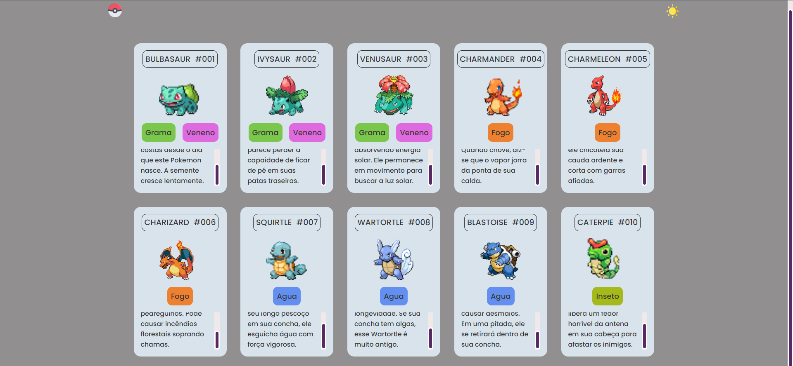

 
    

## 🖥️ PROJETO
Esse é um projeto Web Responsivo. O projeto é um conjunto de cards para mostrar as imagens e descrições dos Pokemons.

## 🚀 TECNOLOGIAS
Esse projeto foi desenvolvido durante o evento Dev em dobro com as seguintes tecnologias:

-HTML
-CSS 
-JavaScript
-GIT E GITHUB
